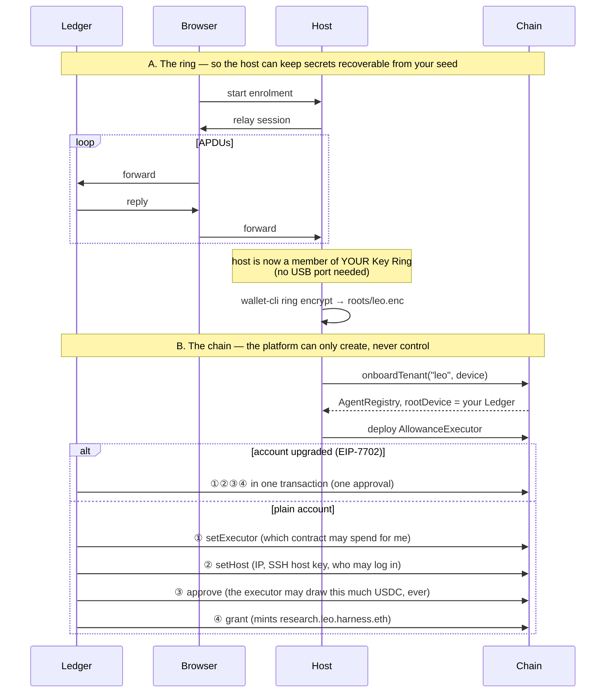
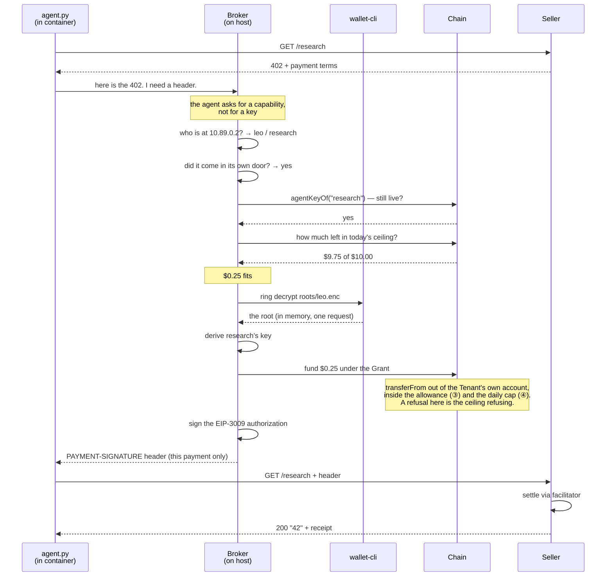
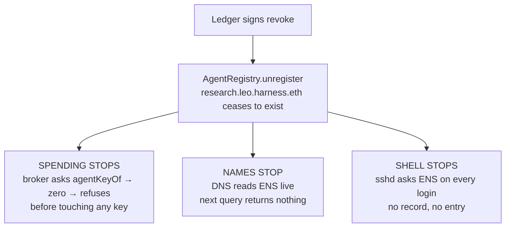

# Harness — architecture

One tap on a hardware wallet sets a ceiling. Agents run autonomously inside it.
One more tap takes everything back: spending, name resolution and shell access,
all from the same fact on chain.

The whole design follows from one rule: **the thing that can be compromised must
never hold the thing that signs.**

---

## The big picture

```
┌─────────────────────────────────────────────────────────────────────────────┐
│  YOUR LAPTOP                                                                │
│                                                                             │
│   ┌────────────┐   USB    ┌──────────────────────────┐                      │
│   │   Ledger   │ ───────▶ │  Browser  (WebHID)       │                      │
│   │  Flex/Gen5 │ ◀─────── │  the Harness dashboard   │                      │
│   └────────────┘          └────────────┬─────────────┘                      │
│    the only authority.                 │                                    │
│    Never leaves this room.             │  HTTP                              │
└────────────────────────────────────────┼────────────────────────────────────┘
                                         │
                                         │  ① APDUs relayed  ② signed txs
                                         ▼
┌─────────────────────────────────────────────────────────────────────────────┐
│  THE HOST  (a VPS with no USB port)                                         │
│                                                                             │
│  ┌───────────────┐   ┌──────────────────┐   ┌────────────────────────────┐  │
│  │  Web app      │   │  APDU relay      │   │  Enrolment store           │  │
│  │  Next.js      │──▶│  browser ⇄ LKRP  │──▶│  member key per tenant     │  │
│  │  :3000        │   └──────────────────┘   │  sealed root per tenant    │  │
│  └───────┬───────┘                          │  (ciphertext at rest)      │  │
│          │                                  └─────────────┬──────────────┘  │
│          │                                                │                 │
│          │                            ┌───────────────────▼──────────────┐  │
│          │                            │  wallet-cli ring encrypt/decrypt │  │
│          │                            │  the real Ledger CLI, unmodified │  │
│          │                            └───────────────────┬──────────────┘  │
│          │                                                │                 │
│          │              ┌─────────────────────────────────▼──────────────┐  │
│          │              │  BROKER      one address per tenant :8402      │  │
│          │              │  hands out capabilities, never keys            │  │
│          │              │  ├─ names the caller by container address      │  │
│          │              │  ├─ checks it came in its own door             │  │
│          │              │  ├─ asks the chain: still granted?             │  │
│          │              │  ├─ asks the chain: room in today's ceiling?   │  │
│          │              │  ├─ opens the root, derives the agent key      │  │
│          │              │  └─ signs ONE payment, returns the header      │  │
│          │              └─────────────────────▲────────────────────────┬─┘  │
│          │                                    │                        │    │
│  ┌───────▼───────┐                            │ ③ "here's my 402"      │    │
│  │  DNS server   │                            │   "here's your header" │    │
│  │  :5354        │                            │                        │    │
│  │  .eth → ENS   │              ┌─────────────┴────────────┐           │    │
│  └───────┬───────┘              │                          │           │    │
│          │          ┌───────────────────────┐  ┌───────────────────────┐│   │
│          │          │ net harness-leo       │╳╳│ net harness-acme      ││   │
│          │          │ CONTAINER  10.89.0.2  │╳╳│ CONTAINER  10.89.1.2  ││   │
│          │          │ leo's Runner          │╳╳│ acme's Runner         ││   │
│          │          │                       │  │                       ││   │
│          │          │  agent.py  ← no key   │  │  agent.py  ← no key   ││   │
│          │          │  sshd      ← asks ENS │  │  sshd                 ││   │
│          │          │  tailscaled           │  │  tailscaled           ││   │
│          │          │  384 MB · 0.5 cpu     │  │  read-only rootfs     ││   │
│          │          │  all caps dropped     │  │  no raw sockets       ││   │
│          │          └───────────────────────┘  └───────────────────────┘│   │
│          │                     ╳╳ isolate=strict: they cannot see each   │   │
│          │                        other at all, only their own gateway   │   │
└──────────┼──────────────────────────────────────────────────────────────┼───┘
           │                                                              │
           │ ④ reads names live                          ⑤ pays with the header
           ▼                                                              ▼
┌────────────────────────────────────────────┐   ┌──────────────────────────────┐
│  SEPOLIA                                   │   │  ANY x402 SELLER             │
│                                            │   │  (not ours)                  │
│  harness.eth                               │   │                              │
│   └── PlatformRegistry                     │   │  @x402/express               │
│        │                                   │   │  facilitator.x402.rs         │
│        ├── leo.harness.eth                 │   └──────────────────────────────┘
│        │    └── AgentRegistry (a clone)    │
│        │         rootDevice = YOUR LEDGER  │
│        │         │                         │
│        │         ├── research.leo.…  ◀── minted by grant, burned by revoke
│        │         └── scout.leo.…           │
│        │                                   │
│        └── acme.harness.eth                │
│                                            │
│  AgentResolver · AllowanceExecutor · USDC  │
└────────────────────────────────────────────┘
```

---

## Who holds what

The security of the whole thing is this table.

| Where | Holds | If it is compromised |
|---|---|---|
| **Ledger** | the root authority | game over, but it is in your pocket |
| **The account itself** | optionally `Simple7702Account`, so four calls become one | it is callable only by the account, and Ledger vets which contract |
| **Browser** | nothing. It forwards bytes | nothing to take |
| **Host: enrolment store** | ring member key, sealed roots | roots open — this is the trusted core |
| **Host: broker** | a key for the length of one request | can sign, but only what the chain allows |
| **Container** | its own ENS name, a Tailscale key | nothing. No key, no crypto library, no neighbour |
| **Chain** | the ceiling, and who is live | it is the referee, not a participant |

The container is deliberately the dumbest thing in the system. That is what lets
you run an agent in it without trusting the agent.

---

## The name tree

Each level is a real ENSv2 registry, not a record in a parent.

```
harness.eth                     PermissionedRegistry — the platform
  │                             owned by us; can create tenants and nothing else
  │
  └── leo.harness.eth           AgentRegistry — one tenant, one machine
       │                        rootDevice = your Ledger.
       │                        Holds: the machine's IP, its SSH host key,
       │                        who may log in, and its spending executor.
       │                        After creation the platform has NO authority here.
       │
       ├── research.leo.harness.eth      an Agent
       │                        Exists because the device signed a Grant.
       │                        Stops existing when the device signs a revoke.
       │                        Its ENS record IS its authority.
       │
       └── scout.leo.harness.eth
```

A grant **mints** a subname. A revoke **burns** it. There is no separate
"enabled" flag to get out of sync — existence is the permission.

---

## Flow ① — Onboarding: one ring, three signatures



After this the host cannot change anything inside `leo.harness.eth`. Only the
device can.

**One tap or four.** An ordinary account can do one thing per transaction, so
onboarding is four approvals. On connect, Harness offers to give the account
code — EIP-7702, delegating to `Simple7702Account` at
`0x4Cd241E8d1510e30b2076397afc7508Ae59C66c9` — and then all four go in one
transaction, which is one approval.

The address is not ours to pick. The Ledger's Ethereum app signs a delegation
only for contracts on its own whitelist, and that list has exactly one
production entry: the reference account from the ERC-4337 team, listed for every
chain (`chain_id = 0`), present since app version 1.22.1. So the code your
account runs is one Ledger vetted, not one we wrote.

The device signs only the authorisation, which is a standalone object rather
than a transaction, and our relayer publishes it — so the upgrade costs one tap
and no gas. Altering the delegate, chain or nonce in transit makes it recover to
a different account and do nothing. Declining is fine; it costs three extra taps
per machine, and the offer stays available in the header.

**Two ceilings, set by two different signatures.** ③ is the token's own
allowance: the most the executor can *ever* pull out of your account. ④ is the
Grant's daily cap, which the registry enforces per window. Revoking closes ④
immediately; the allowance in ③ outlives it and should be set to zero if you are
done with a tenant, which is why it is bounded by what the Grant could spend
rather than left open.

---

## Flow ② — An agent pays for something

This is the flow the whole design exists for. **No key ever enters the container.**



The agent could not sign a second payment with what it was given, and could not
tell you the address it paid from until the broker named it.

---

## Flow ③ — Revoke: one signature, three doors



Nothing is restarted, nothing is redeployed, no revocation list is distributed.
All three are computed from the same fact, so they cannot drift apart.

**Verified live**: after revoking, ENS returned empty, DNS stopped answering,
and the broker refused with *"research.leo.harness.eth has been revoked."*

---

## Where the Ledger Key Ring CLI is used

| Step | How | Why |
|---|---|---|
| Join the ring | LKRP SDK over the browser relay | the host has no USB port; `ring init` needs one |
| Seal a root | **`wallet-cli ring encrypt`** | real CLI, unmodified |
| Open a root | **`wallet-cli ring decrypt`** | real CLI, no human at the keyboard |
| List keys | **`wallet-cli ring keys`** | real CLI |

`tools/harness-ring` lends the CLI the membership the host joined with: a
per-tenant state directory, and the member key in a kernel session keyring that
lives for exactly one command and dies with it.

The ciphertext is ordinary wallet-cli output. Any laptop in the same ring opens
it with `wallet-cli ring decrypt --key harness-agents`. Remove the host from the
ring and the ring's key rotates, and the ciphertext is dead.

---

## Why the broker is not inside the container

It is the question worth asking, and the answer is that it would remove the only
real boundary.

```
        WHAT WE DO                          WHAT WOULD BREAK IT
┌───────────────────────┐           ┌───────────────────────────┐
│ CONTAINER             │           │ CONTAINER                 │
│   agent.py            │           │   agent.py                │
│   ✗ no key            │           │   ✓ ring member key  ←──── can open the
│   ✗ no crypto lib     │           │   ✓ signs for itself       whole tenant's
│   ✗ nothing to leak   │           │   ✓ checks its own limits  root, i.e. every
└──────────┬────────────┘           └───────────────────────────┘ sibling agent
           │ asks                              ▲
┌──────────▼────────────┐                      │
│ BROKER (host)         │              a check that runs inside
│   ✓ ring member       │              the thing it checks is
│   ✓ asks the chain    │              not a check
│   ✓ signs once        │
└───────────────────────┘
```

The agent is the untrusted part by definition — running work of uncertain
provenance is what an agent *is*. A secret in the container is a secret that can
leak.

**How a caller is named**, and why it cannot lie about it:

| Attempt | What stops it |
|---|---|
| Claim another tenant in the request | The broker reads only the socket. There is no field to write a name in. |
| Forge the source address | Needs raw sockets. All capabilities are dropped except six; `CAP_NET_RAW` is not one, and it is TCP, so the reply would go to the forged address anyway. |
| Reach another tenant's Runner | Separate networks with `isolate=strict`. Verified: the connection times out. |
| Ask at another tenant's gateway | Refused: *"leo may only ask at 10.89.0.1"*. Identity still came from the source, so it would only ever have been handed its own capability. |
| Steal a key from a reply | There is no key in the reply. One payment header, for one payment. |

---

## Appendix — where things live

| Thing | Where |
|---|---|
| Dashboard | host `:3000` |
| Broker | one address per tenant, `:8402` on that tenant's gateway. Never `0.0.0.0` |
| DNS (`.eth` → agent IPs) | host `:5354` |
| Runners | one isolated network each (`harness-<tenant>`), plus a Tailscale mesh address |
| Ring members, sealed roots | `~/.config/agentauth/enrolments/` (0600) |
| Grant terms | `x402/grants/<tenant>.<agent>.json` — a record, not an authority |
| Contracts | `contracts/src/` — PlatformRegistry, AgentRegistry, AgentResolver |

The chain keeps a Grant only as a hash, so the terms are filed on disk too.
Editing that file grants nothing: the registry checks the hash, and a wrong copy
simply fails to name an Agent.
